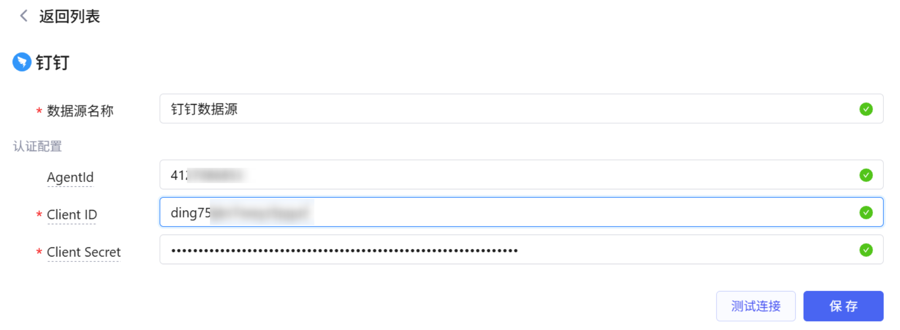
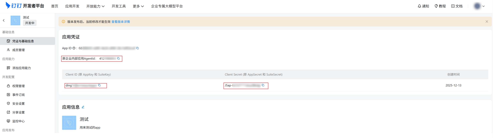
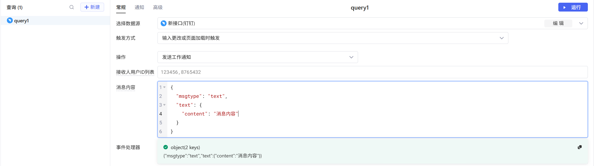
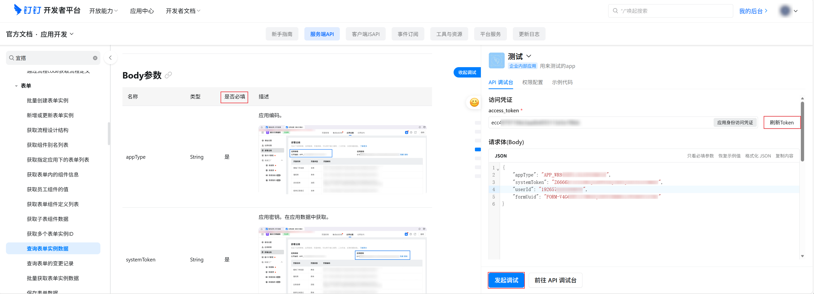
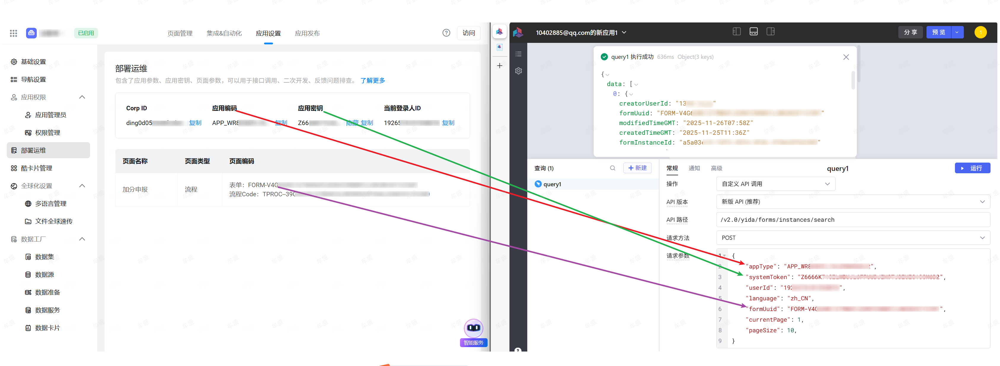

## 新建数据源

1. 进入数据源管理页面，点击「新建数据源」
2. 选择「钉钉」数据源类型
3. 在数据源配置中填写以下参数：
   * **AgentId**：用于发送工作通知时指定应用（可选）
   * **Client ID**：原 AppKey 或 SuiteKey（必填）
   * **Client Secret**：原 AppSecret 或 SuiteSecret（必填）

> **提示**：以上参数请到 [钉钉开发者平台](https://open-dev.dingtalk.com/fe/app) 选择应用 -> 凭证与基础信息 获取

## 认证方式

配置好 Client ID 和 Client Secret 后，系统将自动管理 access_token 的缓存和刷新，无需手动处理。Token 会在过期前自动刷新，确保 API 调用的连续性。

## 创建查询

1. 在查询管理页面，点击「新建查询」
2. 选择您已创建的钉钉数据源
3. 选择要执行的操作类型
4. 根据所选操作填写相应的参数（参考下方操作说明）
5. 点击「运行」按钮执行查询

## 支持的操作

### 1. 获取 Access Token
获取钉钉访问令牌（通常不需要手动调用，系统会自动管理）

**参数**：无需填写参数

### 2. 获取用户信息
根据用户ID获取用户详细信息

**参数**：
- `userid`：用户ID（必填）

**参考文档**：[获取用户信息](https://open.dingtalk.com/document/development/query-user-details)

### 3. 根据手机号搜索用户ID
根据手机号搜索并获取用户ID

**参数**：
- `mobile`：手机号（必填）

**参考文档**：[根据手机号搜索用户ID](https://open.dingtalk.com/document/development/query-users-by-phone-number)

### 4. 根据姓名搜索用户ID
根据用户姓名搜索用户ID，支持精确匹配和模糊匹配

**参数**：
- `queryWord`：姓名（必填）
- `offset`：分页页码（可选，默认 0）
- `size`：分页大小（可选，默认 10）
- `fullMatchField`：匹配方式（可选，1=精确匹配，空=模糊匹配）

**参考文档**：[根据姓名搜索用户ID](https://open.dingtalk.com/document/development/address-book-search-user-id)

### 5. 获取部门列表
获取下一级部门基础信息

**参数**：
- `dept_id`：部门ID（可选，不填则获取根部门列表）

**参考文档**：[获取部门列表](https://open.dingtalk.com/document/development/user-management-acquires-the-list-departments)

### 6. 获取部门信息
根据部门ID获取部门详细信息

**参数**：
- `dept_id`：部门ID（必填）

**参考文档**：[获取部门信息](https://open.dingtalk.com/document/development/query-department-details0-v2)

### 7. 获取部门用户详情
获取指定部门中的用户详细信息

**参数**：
- `department_id`：部门ID（必填）
- `offset`：偏移量（可选，默认 0）
- `size`：数量（可选，默认 10）

**参考文档**：[获取部门用户详情](https://open.dingtalk.com/document/development/queries-the-complete-information-of-a-department-user)

### 8. 发送工作通知
发送工作通知消息

**参数**：
- `userid_list`：接收人用户ID列表（必填）
- `msg`：消息内容，JSON格式（必填）

**参考文档**：[发送工作通知](https://open.dingtalk.com/document/development/asynchronous-sending-of-enterprise-session-messages)

# 自定义 API 调用

如果系统提供的操作无法满足您的需求，可以使用「自定义 API 调用」功能调用钉钉的其他 API 接口。

## 使用步骤

1. 在查询操作中选择「自定义 API 调用」
2. 根据钉钉 API 文档选择 API 版本（新版 API 或旧版 API）
3. 填写 API 路径（例如：`/topapi/v2/user/get`）
4. 选择请求方法（GET 或 POST）
5. 填写请求参数（JSON 格式）

## 示例：调用宜搭数据 API

下面以调用宜搭数据 API 为例，演示如何使用自定义 API 调用功能：

### 步骤 1：确定 API 版本

根据钉钉 API 文档，确认该 API 使用的版本。示例中该 API 为新版 SDK，因此选择「新版 API (推荐)」。

### 步骤 2：生成请求体

根据 API 文档中的 Body 参数要求，生成请求体。在钉钉 API 调试工具中，根据参数是否必填填写相应内容，然后点击「发起调试」。

### 步骤 3：复制请求体

调试成功后，复制生成的请求体内容，粘贴到自定义 API 调用的「请求参数」框中，点击运行即可获取数据。

## 注意事项

- **API 版本**：新版 API 使用 `https://api.dingtalk.com`，旧版 API 使用 `https://oapi.dingtalk.com`
- **参数格式**：请求参数必须是有效的 JSON 格式
- **权限要求**：确保您的应用具有调用该 API 的权限

