# Barda 更新日志

## 2026年1月21日 `bate1.0.1`
​
## 功能添加

### 系统功能
- **审计日志**: 添加审计日志功能，包括API接口、服务和事件监听器，支持查询和记录用户操作 (1f982086, f254b20f)
- **Mongdb UpdateMany命令**: 增强UpdateMany命令，支持在upsert时合并简单等值条件到更新文档 (1270b021)

### 新增组件
- **统计卡片组件**: 添加统计卡片组件，支持动画持续时间属性、普通和紧凑两种尺寸模式 (0444ebb2, fed87927, c9847fb0)

### 组件增强
- **键值列表组件**: 增强键值列表组件，新增批量添加功能及JSON编辑器支持 (965fd8ec)
- **Mongo查询组件**: 添加upsert选项到Mongo查询组件，并更新国际化文本 (075a6a24)

- **JSON编辑器**:
  - 添加失焦事件 (c4123d32)
  - 添加自动格式化功能，并更新国际化文本 (f5fc5acf)
- **评论组件**: 添加评论删除确认弹窗功能；暴露点击序号 (0807e968, d4314bd9)
- **表格组件**:
  - 添加跳转下一页、上一页、最后一页的方法 (f3c5637f)
  - 增强表格可编辑单元格传入列属性 (9fc5f3db)
  - 添加标签点击事件处理 (b2bc0882)
  - 添加tags类型列 (747489b0)
  - 添加开关组件类型 (f262b2d7)
  - 图像列允许自定义边距和圆角 (f1dd96f2)
  - 添加"更改"事件 (adc15b7f)
  - 添加隐藏列时允许搜索的功能 (b943e8f8)
  - **富文本列类型呢**: 添加富文本编辑器组件，支持新筛选操作符、复选框列表、时间戳功能、回车键处理、选择位置管理、onBlur事件，使用react-quill-new (2585c702, bda3ecc5, 4389cd2c, 01bd50a3, e508bb2f, 80f23c88)
  - **标签组列类型**: 添加标签组件类型，支持自定义标签、自动计算边框和背景色 (40fab8b3, 7708454a, fd8a5e26)
- **抽屉组件**: 增强抽屉组件以及修复升级antd6后显示异常bug (2629f09c)
- **对话框**: 为对话框升级显示滚动条功能 (75a8c788)
- **网格容器组件**: 优化网格容器组件滚动条显示逻辑 (9b08d466)
- **tabbed组件**:
  - 美化样式 (b58d148d)
  - 添加activeTabBackground和cardStyle属性 (8254a727)
  - 添加组件画布内边距属性 (04c70652)
- **图表组件**:
  - 点击数组中新点击点始终位于前面 (28c6ad82)
  - 添加点击和选中事件的载荷数据支持 (935b441a)
- **数据视图组件**: 添加复制按钮功能 (0cf6e198)
- **分段组件**:
  - 支持水平和垂直布局 (b4652c86)
  - 添加徽章支持 (3da16918)
- **结果面板**: 允许选择文本 (89bbaa68)
- **自动完成组件**: 添加提交方法 (11c9bde4)
- **日历组件**: 增强日历组件以支持事件的添加、编辑和删除功能，并添加确认删除的提示 (4bcbc42f)
- **CompIDE和CompPlayground**: 添加可切换的JSON视图和属性面板 (6493e153)
- **开关组件**: 获取editable的值 (b10376e3)

### 样式与布局增强
- **Drawer和Modal组件**: 添加Drawer和Modal组件的bodyPadding样式支持，增强布局灵活性 (dcbcd665)
- **多组件**: 添加margin样式到多个组件以增强布局一致性 (ed78e035)
- **多组件**: 添加清除事件处理支持到多个组件，并更新国际化文本 (c951dd15)

### 系统功能
- **组件框**: 右侧组件框支持中文拼音搜索 (69c31035)
- **数据源**: 添加钉钉数据源支持及相关文档 (ee801fd6)
- **工具库**: 加载dayjs所有插件，简化utils.openUrl方法 (87453817, cbd6deb8)

### 依赖升级
- **Ant Design**: 更新antd库到6.0 (f3df5aa6)

---

## Bug修复 (Bug Fixes)

### 组件修复
- **MongoDB**:
  - Mongdb的翻译不全 (ab96bc91)
  - 修复mongdb在upsert模式下没有将查询条件插入文档的bug (24aeb853)
- **App列表**: 修复app列表中名称总是显示省略号的bug (0af4fdd0)
- **成员权限**: 修复成员权限中显示文件夹重命名菜单的bug (c010a5c4)
- **JSON编辑器组件**: 修复json编辑器组件显示bug (d8138b25)
- **气泡弹出框**: 修复气泡弹出框样式重影的bug (eeee630f)
- **抽屉组件**: 
  - 修复抽屉组件宽度设置失效的bug (c9f725f8)
  - 修复抽屉组件升级antd6.0后样式错误，升级容器组件滚动条，防止出现抽风现象 (6a180e3f)
- **Ant Design升级**: 修复antd升级后样式问题 (04337377)
- **RichTextEditModal**: 移除RichTextEditModal中的调试日志和标题 (b72776b9)
- **徽章**: 修改徽章设置逻辑，修复显示错误bug (3739f04e)
- **Tree组件**: 修复tree节点选中时颜色bug (1459e247)
- **气泡卡片**: 修复气泡卡片样式bug (9ce89613)
- **customSelect和Dropdown组件**: 修复customSelect和Dropdown组件的样式 (ac326fa3)
- **下拉文本**: 修复下拉文本不垂直居中的bug (d533c04e)
- **分隔组件**: 修复分隔组件初始不显示的bug (ce6ba4e1)
- **输入框**: 修复输入框label垂直不居中 (852259c4)
- **右侧组件图标**: 修复右侧组件图标大小bug (fcd46a92)
- **评论输入框**: 修改评论输入框无法获取到内容的bug (b3236677)
- **代码面板**: 修复代码面板导致表格列项目弹出框异常关闭的bug (0365048f)
- **表格搜索**: 修复表格搜索未显示列的bug (080113c8)
- **搜索按钮**: 修复点击搜索按钮无法触发提交事件 (7816f73f)
- **开关组件**: 修复开关组件在值变化时的处理逻辑 (f76021ae)
- **色彩组件**: 修复色彩组件样式 (0043605f)
- **导航页**: 
  - 修复打开导航页时页面崩溃的bug (3631cd46)
  - 修复导航页编辑时无法修改导航菜单的bug (b672cb98)
  - 修复导航页设置不显示的bug (4589b458)
- **弹出气泡卡片**: 修复弹出气泡卡片页面抖动的bug (56a9bda6)
- **标签配置**: 修复修改标签配置自动关闭的bug (f30ecbc0)
- **图标渲染**: 优化图标渲染逻辑，确保异步加载完成前不显示破损图标 (9f2d74f6)
- **右侧树形列表**: 修复选择多个组件时右侧树形列表图标显示过大的bug (628a6721)
- **重复提交**: 修复重复提交的bug (ec5f6be4)
- **版本显示**: 修复版本显示bug (f2bf92f9, 42dc5b9f)

### 后端修复
- **Node服务**: 
  - 修复前后端调试时载入文件夹名称错误的bug (ded213cb)
  - 修复node-server启动失败的bug (dee2c33b)
  - 修复node_server列表图标不显示的bug (a7197963)
- **Windows用户名**: 修复自动获取Windows用户名 (47c1429d)
- **代码编辑器面板**: 修复setCodeEditorPanelOpen读取崩溃的bug (0b1a1b46)

---

## 其他修改 (Other Changes)

### 重构 (Refactor)
- **API替换**: 替换废弃的optionFilterProp、onDropdownVisibleChange的api (754b68f1)
- **Ant Design API迁移**: 
  - 将antd废弃的dropdownRender替换为popupRender (17fdbf64)
  - 将antd废弃的popupClassName属性用classNames.popup.root替代 (00bd6aab)
  - 将antd废弃的destroyOnClose用destroyOnHidden替代 (d06f890c)
  - 将antd废弃的destroyTooltipOnHide用destroyOnHidden替代 (bcd33fed)
  - 将antd废弃的dropdownStyle属性替换为styles.popup.root (9cc98e04)
- **依赖配置**: 使用 CompDepsConfig 替代 DepsConfig (44f9d169)
- **MyResizeDetector**: 标记MyResizeDetector为废弃，建议使用react-resize-detector替代 (91293648)

### 修复导入错误
- **导入错误**: 修复导入错误 (324da68b)

### 配置与工具 (Chore) 
- **Docker配置**: 更新docker-compose配置，修改barda服务镜像名称并调整MongoDB端口暴露设置 (ef6896a7)
- **代码格式**: 更新最大换行宽度为120字符 (718ef8b2)
- **Alert组件**: 替换Alert废弃的message属性 (ee52e277)
- **时间线组件**: 替换时间线组件废弃的pending属性 (faeb8d31)
- **发布**: 更新发布barda-comps 0.0.13 (0ce6f202)

# OpenBlocks历史更新
## 2023年3月23日 `v1.1.8`​

* 新增**日历**组件 📅，支持拖拽、多视图管理日程  
  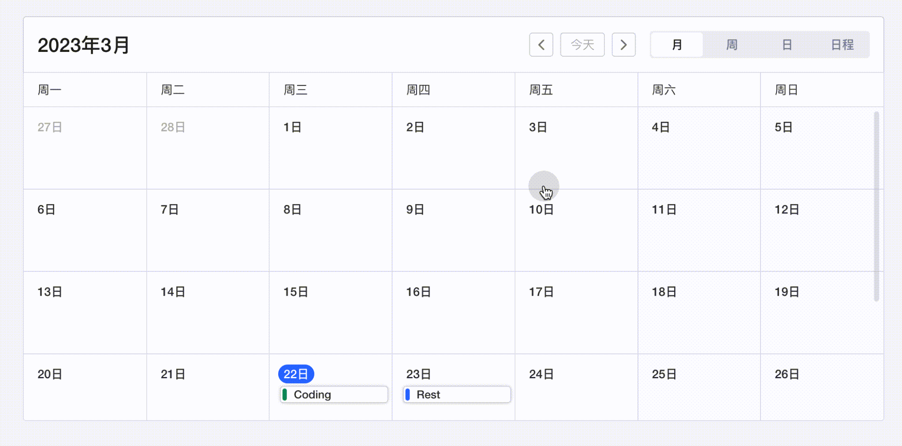​
* 表格组件新特性：

  * 支持**批量调整**列设置：隐藏、可编辑、自动列宽、支持排序、对齐方式  
    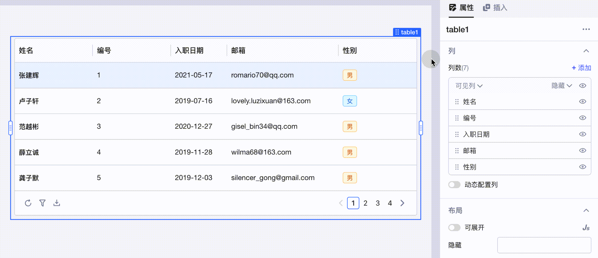​
  * 新增 `toUpdateRows`​ 字段，方便编写 SQL **批量更新**编辑后的表格行
  * 新增 `selectedIndex`​ 和 `selectedIndexes`​ 字段，暴露当前选中（多）行的下标
  * 新增事件：翻页、刷新
* 优化 JavaScript 第三方库的安装和管理功能  
  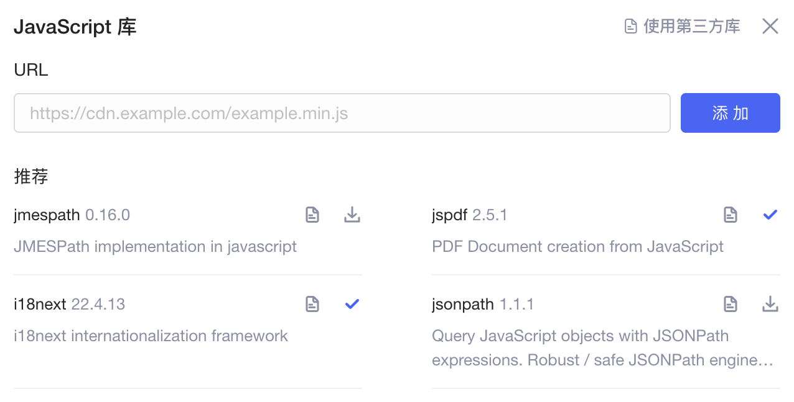​

  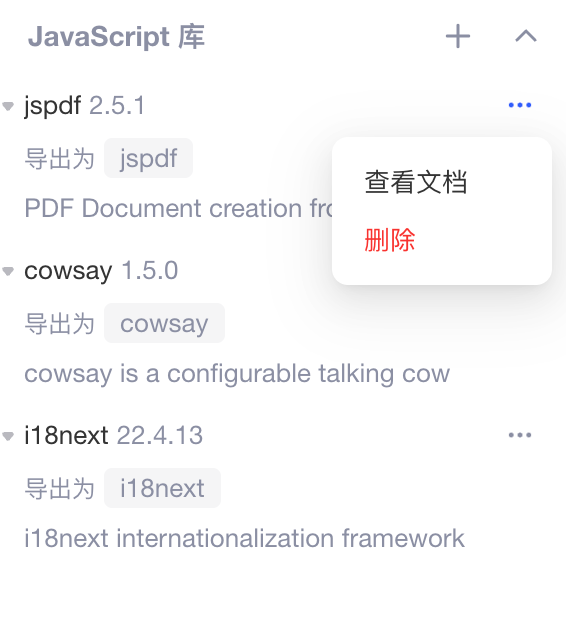​
* 查询编辑器支持**文件夹** 📁 和**搜索** 🔍 功能
* 右侧属性面板支持关键字**搜索** 🔍
* 聚合页新增菜单项动作**打开链接**
* GraphQL 数据源支持转发 Cookies
* LDAP 身份源支持 ldapsearch
* 走马灯 (Carousel) 组件支持配置背景色
* 优化时期范围组件的展示值范围，根据校验规则过滤无关值
* 优化 listView 和 table 中列表逻辑的底层实现
* 优化属性面板展示，切换组件时属性面板各部分维持切换前的展开/收起状态
* 优化应用预览态和发布态显示，去除画布底部多余的空白部分
* 优化表格日期列类型的显示，字段内容不规范时显示为空
* 修复列表 (List View) 中多选 (Checkbox) 组件被错误勾选的问题
* 修复表格排序大小写不敏感的问题
* 修复表格组件中编辑多标签单元格的错误
* 修复表格组件扩展视图中嵌套的表格列不随数据字段变化的问题
* 修复组件标签在顶部模式下展示不全的问题
* 修复文件上传组件调用 clearValue 方法后 parsedValue 不清空的问题
* 修复其他已知问题

## 2023年3月9日 `v1.1.7`​

* 表格组件新特性：

  * 支持将数据中的 `children`​ 数组展示成子表  
    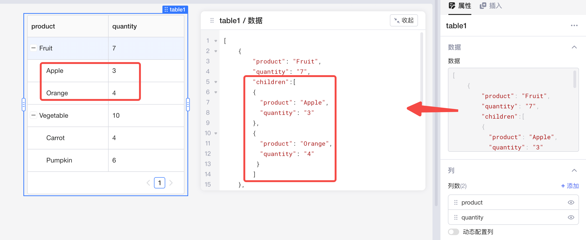​
  * 支持为表格行配置扩展视图  
    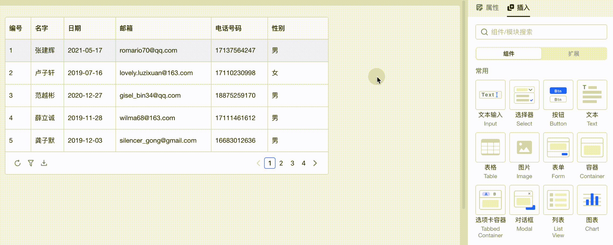​
  * 新增列类型：布尔值 (Boolean)、日期 (Date)、评分(Rating) 和进度条 (Progress)
  * 优化各种列类型的颜色表现，与应用主题一致
  * 优化列宽设置，默认为适应字段长度的固定值
* 列表 (listView) 支持翻页，新增分页设置
* 新增数据库：MariaDB、OceanBase、TiDB、openGauss、达梦、PolarDB、GaussDB、TDengine、SequoiaDB、MogDB 和 StarRocks
* 新增 API：Jira、CircleCI、Hugging Face Inference、Hugging Face Endpoints、GitHub、Notion、Gitlab 和 Shopify
* 新增 JWT (JSON Web Token) 身份认证
* 新增移动端聚合页，支持底部导航菜单；优化移动端日期时间类组件交互
* REST API 数据源支持转发 Cookies
* OpenAI 数据源支持 Chat GPT 接口
* 事件的「控制组件」动作支持选择底层 HTML 元素方法和输入参数，如 `setSelectionRange()`​、`setRangeText()`​、`focus()`​ 和 `seekTo()`​
* 私有化部署支持配置访问限制端口 (disallowed-hosts) 列表
* 连续执行同一查询时，支持在查询的高级面板配置是否「忽略之前未完成的执行结果」
* 优化进度条组件的数值展示
* 优化删除企业的弹窗信息
* 修复分割线组件上下不居中的问题
* 修复查询库中代码提示没有元数据信息的问题
* 修复表单的非必填字段为空时提示校验失败的问题

## 2023年2月24日 `v1.1.6`​

* 新增「数据变化响应器」查询，支持为任何数据的变化添加事件并设置响应动作  
  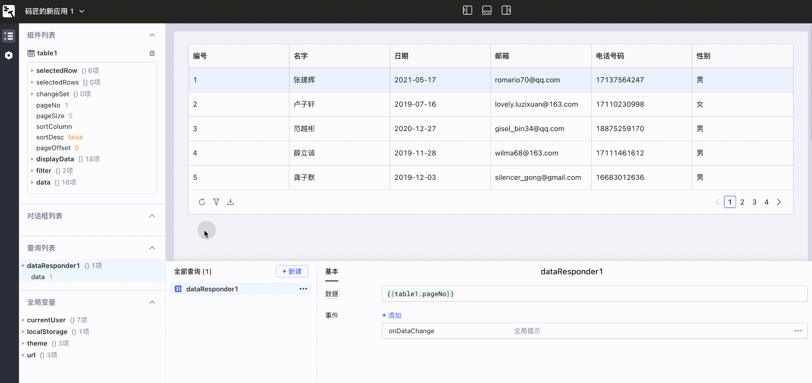​
* 新增全局变量 `theme`​，支持方法 `theme.switchTo()`​，可动态切换应用主题  
  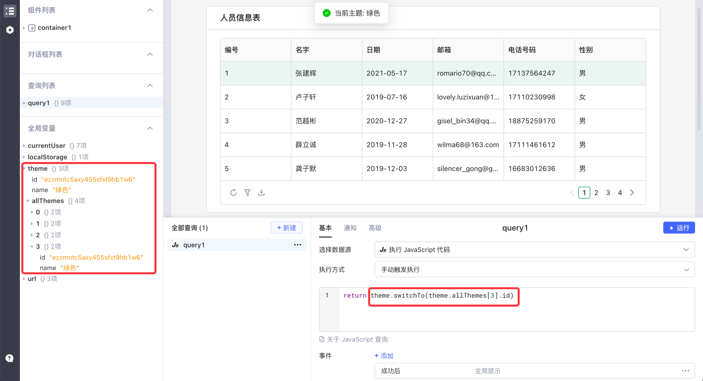​
* 新增签名版 (Signature) 组件  
  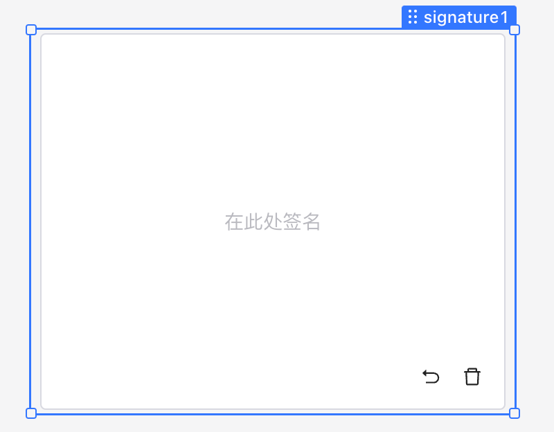​
* 企业设置新增身份源管理，快捷配置不同的登录渠道  
  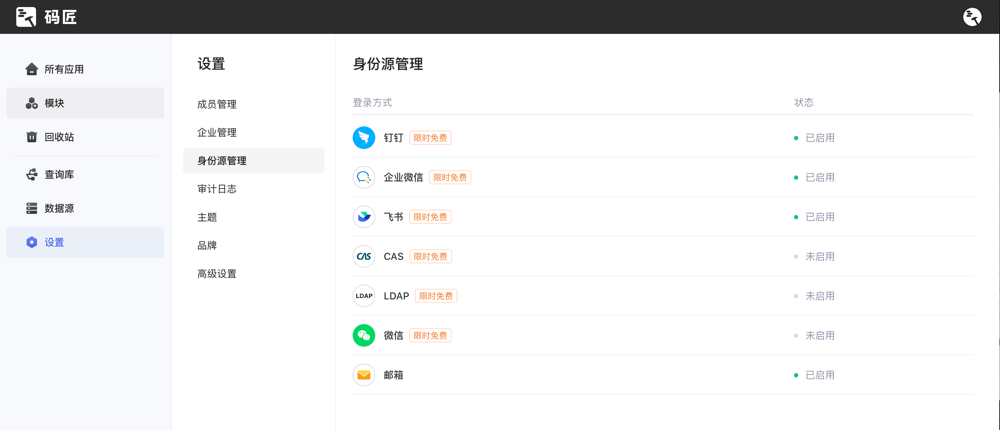​
* 支持从钉钉身份源导入组织架构信息，同步通讯录群组
* 新增以下数据源：

  * CouchDB
  * Athena
  * Lambda
  * WooCommerce
  * OpenAI
* 暴露各组件的底层 HTML 元素方法，如各 UI 组件的 `focus()`​ 和 `blur()`​ 方法；输入类组件的 `select()`​ 和 `setSelectionRange()`​ 方法；视频、音频组件的 `seekTo()`​ 方法等
* 列表 (listView) 支持嵌套使用，可配置子项下标 `i`​ 和子项对象 `currentItem`​ 的命名
* JavaScript 查询和事件动作中支持 `setTimeout`​ 和 `setInterval`​ 方法
* 文本组件支持两端对齐
* 优化代码提示，局部变量排序更靠前
* 修复代码自动补全对含有 `-`​ 符号的属性名失效的问题
* 修复日期范围组件校验出错的问题
* 修复表格组件 `displayData`​ 包含已隐藏字段的问题
* 修复选择类组件在自动模式下，代码提示没有 `item`​ 和 `i`​ 的问题
* 修复页面切换后原应用报错信息的展示问题

## 2023年2月9日 `v1.1.5`​

* 新增 DynamoDB、OpenAPI 和 n8n 数据源​
* 新增宫格 (Grid) 组件，支持多列数据展示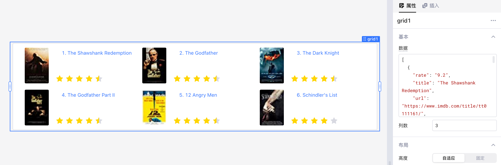​
* 完善列表 (listView) 功能：

  * 支持暴露内部组件数据，例如：`listView.items[0].input1.value`​
  * 除 `i`​ 变量外，局部变量新增 `currentItem`​
  * 取消行数配置，支持自定义 `data`​ 字段
* 优化表格组件：

  * 新增重置选中行方法 `resetSelections`​
  * 「链接」、「多链接」列类型新增禁用属性
  * 编辑「标签」列时支持搜索和新建标签项
  * 支持设置列宽为固定值
  * 提升翻页性能
* Microsoft SQL Server 数据源支持 GUI 模式
* 私有化镜像默认关闭 JS 沙箱
* REST API 查询图标替换为 HTTP 方法标签
* 企业主题设置支持自定义 Echarts 样式
* Lowcoder登录链接支持参数 `loginType`​，可指定登录方式
* 私有化部署的单企业模式下，管理员可重置用户密码
* 首页左侧边栏文件夹支持重命名
* 审计日志支持查询库查询
* 代码字体统一为 Roboto (macOS/Linux/Windows)
* 查询库支持拖动展开查询结果
* 修复输入变化时触发查询的防抖机制问题

## 2023年1月17日 `v1.1.4`​

* 表格组件支持编辑表格列和保存修改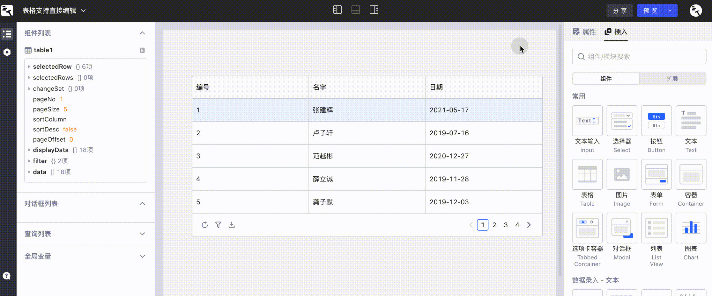​
* 新增 S3 数据源
* REST API 数据源支持自签名证书、优化 URL 验证
* 维格表数据源支持自定义方法
* 组件内搜索功能支持不区分大小写的模糊匹配
* 表单组件新增加载中 `loading`​ 属性
* 数据源权限管理优化：拥有使用权限的成员不能查看数据源的详细信息
* 企业成员管理优化：管理员可以查看成员详情
* 修复 JavaScript 匿名函数代码格式化失败的问题
* 修复音频、视频组件自动播放配置不生效的问题
* 修复扫码组件蒙层配置不生效的问题
* 修复表单校验的正则表达式 (Regex) 及自定义规则的问题
* 修复多行输入组件的输入框不能自动缩放的问题
* 修复表格组件性能问题
* 修复导入查询至查询库后，切换页面导致数据丢失的问题
* 修复按钮事件的节流配置不生效的问题

## 2022年12月30日 `v1.1.3`​

* 新增扫码 (Scanner) 组件，支持扫描二维码和条形码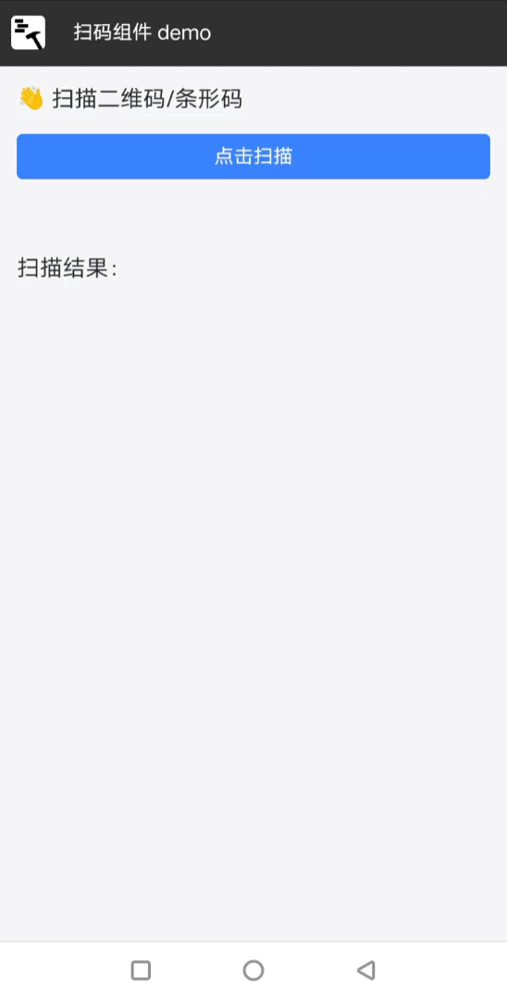​
* 企业微信数据源支持 JS SDK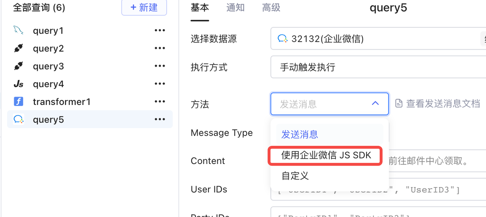​
* 查询库新建查询时支持从文件导入，所有查询支持导出为 JSON
* 查询库中 SQL 查询支持「禁用预编译」（需要先配置数据源「支持切换预编译」）
* 组件的样式属性中颜色输入框支持展开
* 表格组件新增方法 `setPage`​、`setSort`​ 和 `setFilter`​，新增事件 `filterChange`​ 和 `sortChange`​
* 表格组件支持配置工具条位置
* 表格组件支持切换「数据加载时显示加载状态」开关
* 表格组件中「多链接」和「按钮」两种列类型展示优化
* 文本输入、选择器、文件上传、日期和选项卡容器等多个组件支持配置标签文本的前置图标或后置图标
* 选择器组件暴露当前选项索引 `selectedIndex`​ 和 当前选项标签 `selectedLabel`​
* 对话框和抽屉支持配置是否「展示蒙层」
* 表单和容器支持交互禁用 `disabled`​ 属性
* JS 查询执行方式调整为「页面加载时执行」和「手动触发执行」
* JS 查询中运行从查询库导入的其他查询时，支持传递参数
* REST API 支持多种 HAL 等多种 JSON 类型
* REST API 数据源配置支持 Extra body 字段
* 审计日志展示优化
* 私有化部署支持移除企业成员
* 修复维格表数据查询的问题
* 修复容器内图片抖动的问题
* 修复第三方 JS 库执行顺序的问题
* 修复 REST API 解析文件上传参数的问题

## 2022年12月8日 `v1.1.2`​

1. 数据浏览器显示优化：以树形结构展示组件列表，更方便找到对话框 (Modal)、抽屉 (Drawer) 等

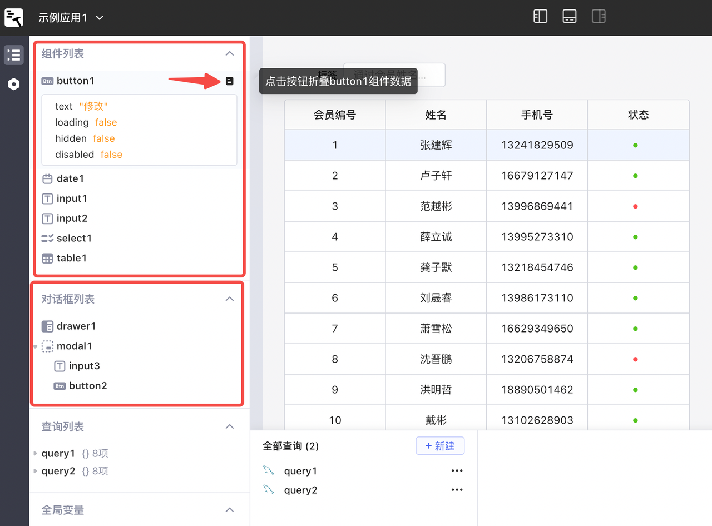​

2. 表格组件支持动态配置列

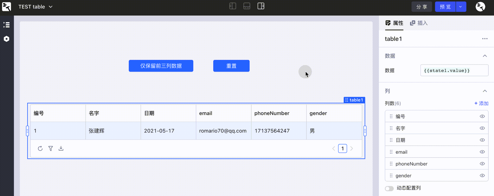​

3. 新增 GraphQL 数据源

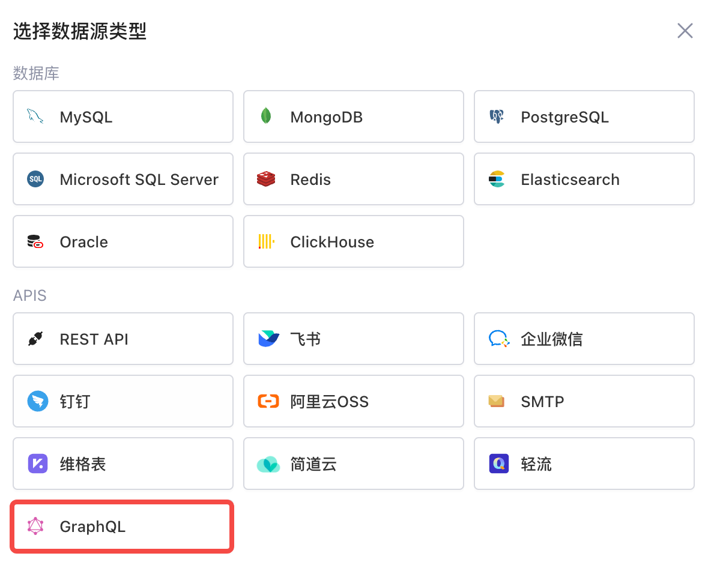​

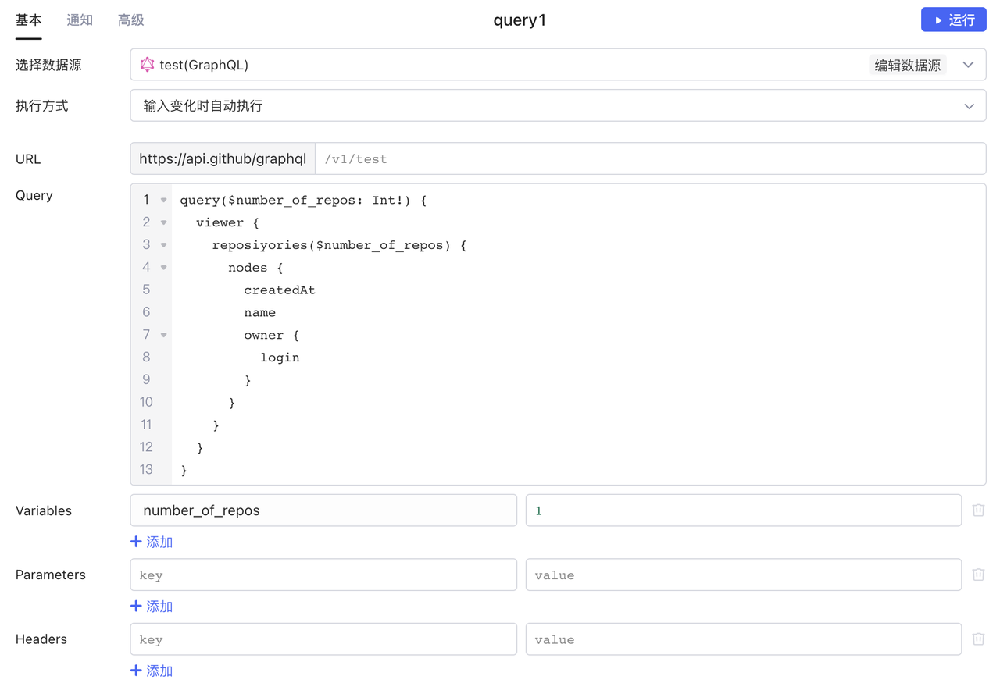​

4. 模块方法支持添加参数

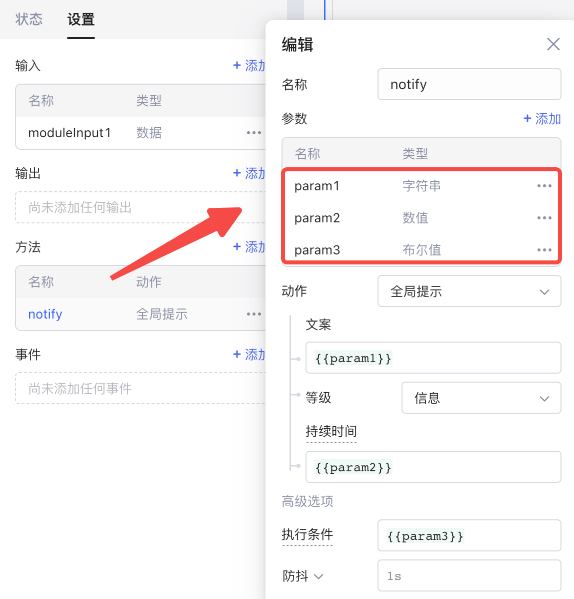​

5. 树形选择组件支持关键字搜索

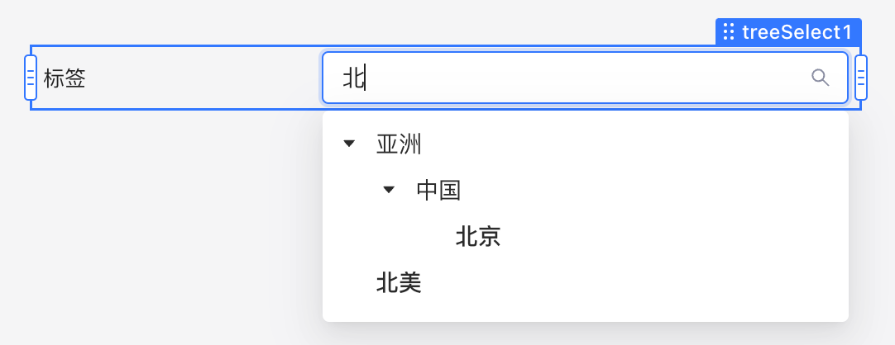​

6. 支持细粒度的数据源权限管理

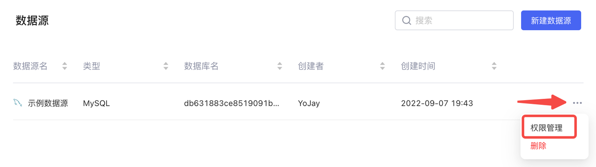​

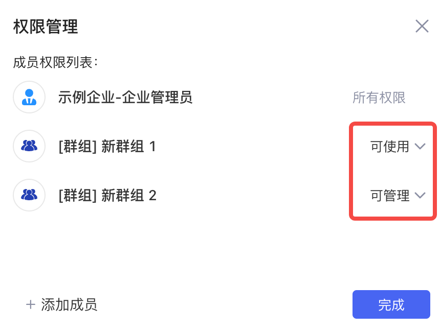​

7. 支持添加 npm 插件包
8. 语法检查增加对 JavaScript 新特性的支持
9. 修复代码编辑器高亮不正确的问题
10. 修复文本组件展示英文长文本时换行错误的问题
11. 修复聚合页中菜单项的标签为空时，无法选中并编辑的问题
12. 修复导航栏组件中子菜单项的隐藏和激活属性失效的问题
13. 修复导入应用后 REST API 数据源出错的问题

## 2022年12月1日 `v1.1.1`​

1. 文件上传组件新增解析 Excel、JSON、CSV 和文本文件功能。

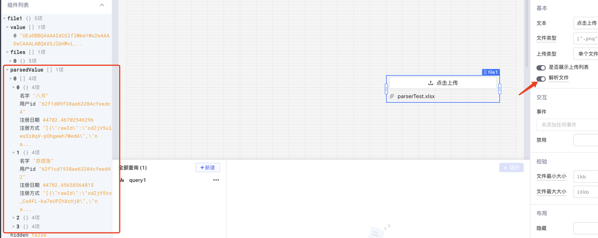​

2. “企业设置”功能挪到用户主页，使用起来更加方便快捷。

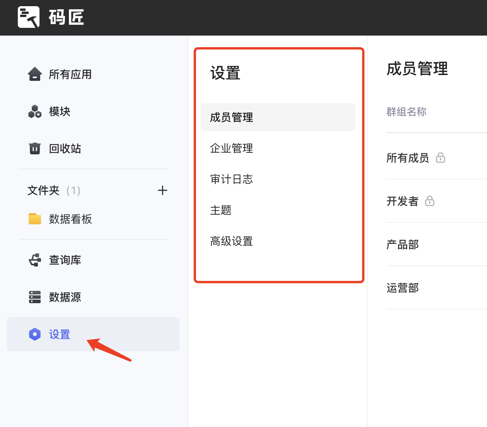​

3. 私有化部署支持配置单企业模式，该模式下仅存在一个企业。

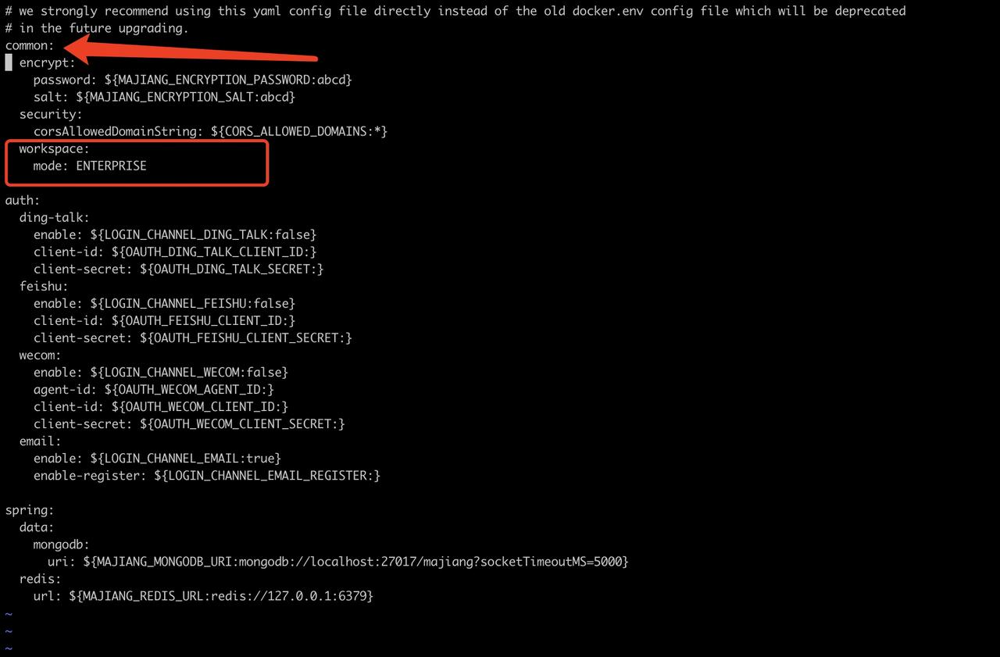​

4. PostgreSQL、Microsoft SQL Server、ClickHouse 等 SQL 数据源支持切换预编译模式。

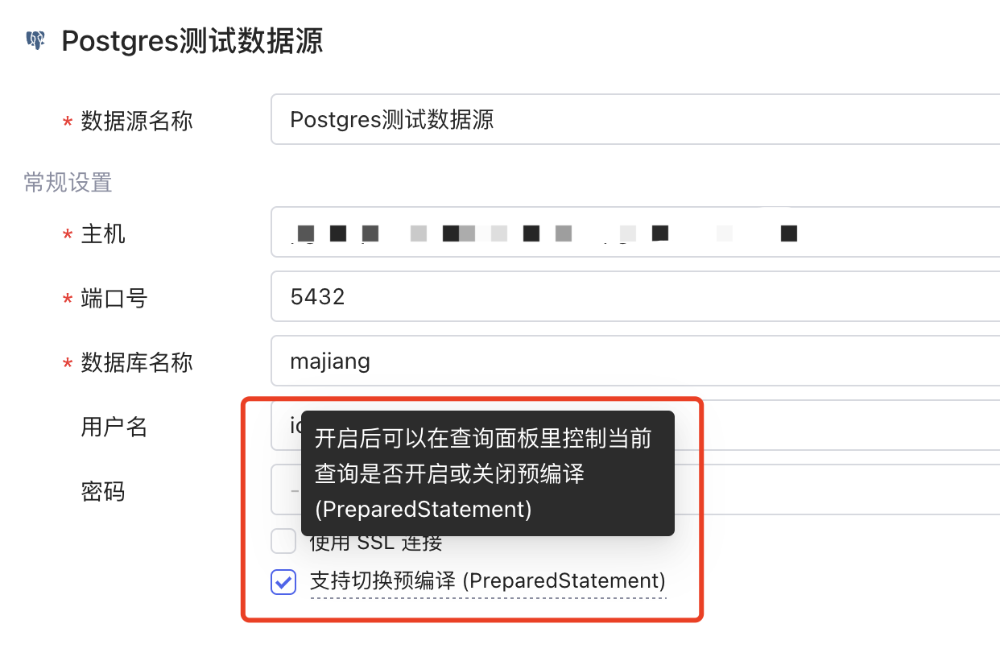​

5. 支持自定义键盘快捷键功能，现在可以通过设置快捷键来触发查询，控制组件以及更多操作！

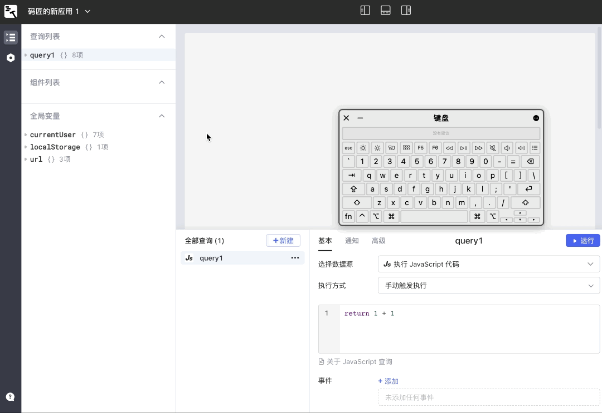​

## 2022年11月18日 `v1.1.0`​

* 编辑页增加左侧工具栏，支持应用内复制、删除应用
* 应用首页适配移动端
* 支持企微内自动登录功能
* 动作选项新增执行运行 Javascript 选项
* 表格支持设置行/单元格颜色
* 图表组件支持设置数据点颜色
* 解决非 sql 类查询不能传参数的问题
* mongo 数据源支持语法补全

## 2022年11月3日 `v1.0.21`​

* 首页新增支持文件夹、增加回收站功能
* 新增走马灯和可折叠容器组件
* 图片组件支持自适应高度，支持点击预览
* 选项卡容器组件的选项增加隐藏属性
* 表格组件暴露行点击与选择改变事件、支持时间列类型
* 对话框类组件支持拖动调整宽度
* 新增简道云数据源

## 2022年10月13日 `v1.0.20`​

* 企业设置支持配置默认主页，非开发者将默认打开该页面
* 新增 JSON 查看和 JSON 编辑组件
* 新增音频、视频组件
* 新增树形展示与树形选择组件
* 新增维格表数据源
* 登陆注册适配移动端
* 图表组件暴露当前选中数据
* 表格组件支持固定列

## 2022年9月27日 `v1.0.19`​

* 新增自定义主题功能
* 新增查询库功能，支持查询的全局复用
* 应用支持公开分享
* 模块支持配置事件与暴露方法
* 新增聚合页类型，支持左侧边栏菜单（入口在企业设置->实验室）
* 组件隐藏时，下方相邻组件自动补位
* 部分组件新增 icon 配置
* 新增二维码组件
* 表格组件支持使用者调整列宽，隐藏列

## 2022年9月8日 `v1.0.18`​

* 支持引入自定义 JavaScript 脚本和 CSS 样式
* 图表组件支持 Y 轴格式化
* 画布视觉优化，对齐辅助点改为辅助网格
* 全局变量增加 localStorage，提供系统 utils 方法
* 优化部分组件对齐困难的问题

## 2022年9月1日 `v1.0.17`​

* 编辑区查询面板支持临时状态和数据转换功能
* 输入类组件增加只读选项
* 首页增加数据源管理功能
* 增加列表组件
* 优化图表组件的默认主题样式
* 组件国际化，根据浏览器语言自动选择中文和英文
* 增加 ClickHouse 数据源

## 2022年8月24日 `v1.0.16`​

* 表格组件增加工具栏，支持下载、筛选、刷新
* 完善 IDE 快捷键，右下角帮助里可打开快捷键面板
* 增加 Oracle 数据源
* 表格等组件增加颜色配置项
* 代码框支持放大和拖拽

## 2022年8月16日 `v1.0.15`​

* 上线模块功能，支持组件与查询的复用
* 增加 SMTP 数据源，支持发邮件
* 组件视觉优化，调整主题色与圆角
* 部分组件优化颜色选择面板
* 查询支持定时执行
* 支持 CAS SSO 登录方式
* 首页应用列表改为按创建时间倒序排列

## 2022年8月8日 `v1.0.14`​

* MySQL 数据源新增 GUI 模式
* 增加应用设置，可以调节画布大小
* 查询增加高级配置项，可以自定义超时时间，写操作支持配置二次确认弹框
* 图表组件支持配置是否显示标签
* 修复 echart json 模式不支持 function 的问题
* 修复 table 组件在数据变化时自动新增列的问题

## 2022年7月29日 `v1.0.13`​

* 新增审计日志查看功能
* 新增开发者群组，普通成员移除新建应用权限
* 输入类组件增加 focus 方法和 submit 事件
* 新增阿里云 OSS 数据源
* 新增 iframe 组件

## 2022年7月21日 `v1.0.12`​

* 增加表单组件，并支持从数据库自动生成表单
* 表格支持 Markdown 列类型
* 修复编辑页选择组件时的卡顿问题
* 组件拖动在容器边缘时支持改变宽度
* 支持禁用 prepared statement

## 2022年7月15日 `v1.0.11`​

* 组件选项里新增组件文档链接
* 新增导航组件
* 新增 MS Sql Server 数据源

## 2022年7月7日 `v1.0.10`​

* 增加**查看历史记录**功能
* 新增 Redis、ElasticSearch 数据源连接
* 新增自定义组件、级联选择器组件
* 容器组件自带 header 和 footer，增加颜色配置
* 图表组件支持 echarts json 配置
* 编辑页新增右下角帮助按钮
* 查询 (Query) 增加**通知**配置项

## 2022年6月24日 `v1.0.9`​

* 新增选项卡容器 (tabbedContainer) 组件
* 新增富文本框、分割线组件
* 新增「执行 JavaScript」的资源类型
* 表格组件改为固定高度模式
* 私有化部署支持钉钉与企业微信登录
* 左侧边栏支持显示属性描述

## 2022年6月10日 `v1.0.8`​

* 支持在新窗口打开代码框
* 左侧边栏 hover 显示组件属性说明
* 新增简易 CRM 模板