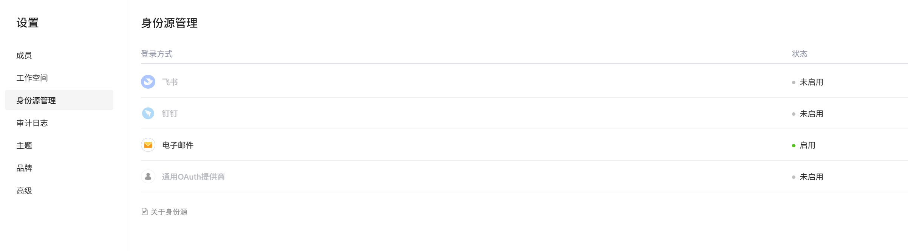
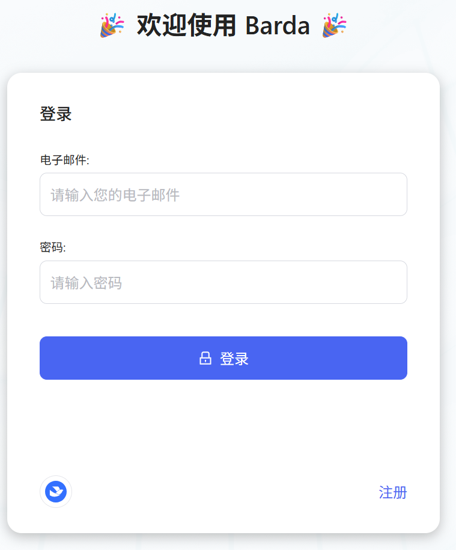
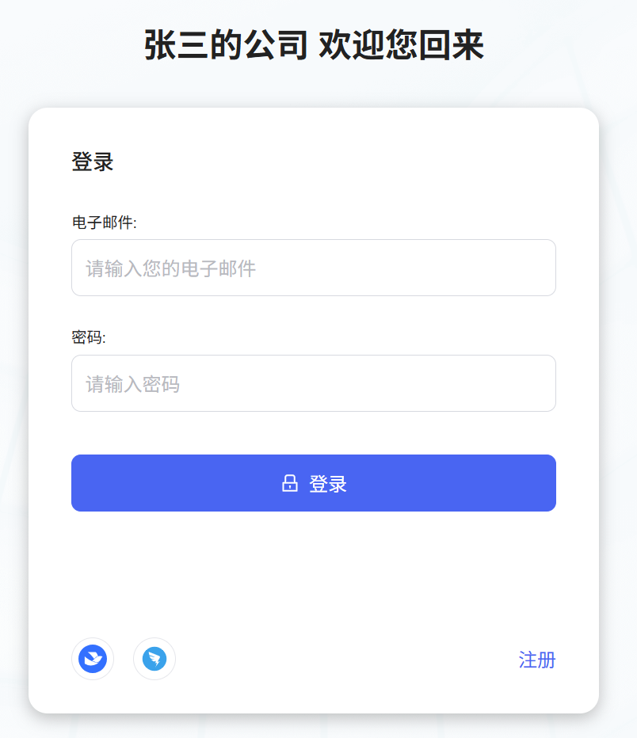

# 身份源管理 (Identity Source Management)

## 概述

Barda 支持多种第三方身份认证提供商，允许用户通过 OAuth 2.0 / OIDC 协议使用外部账号登录系统。

身份源配置入口：**设置 → 身份源管理**。

## 支持的身份源类型

| 类型                        | 标识       | 配置方式           | 说明                                 |
| --------------------------- | ---------- | ------------------ | ------------------------------------ |
| 表单登录 (Form)             | `FORM`     | 默认打开         | 用户名/密码表单登录                  |
| 飞书 (Feishu)               | `FEISHU`   | Client ID + Secret | 飞书 OAuth 2.0 登录                  |
| 钉钉 (DingTalk)             | `DINGTALK` | Client ID + Secret | 钉钉 OAuth 2.0 登录                  |
| 通用 OAuth 提供商 (Generic) | `GENERIC`  | 全字段自定义       | 支持任意 OAuth 2.0 / OIDC 标准提供商 |

## 管理界面

### 身份源列表

- **登录方式**：显示身份源图标和名称
- **状态**：绿色 = 已启用，灰色 = 未启用
- 点击任意行进入配置详情页
  

## 登录页面

配置并启用身份源后，登录页面自动显示第三方登录按钮：

  

### 组织专属登录

各组织拥有独立的登录页 `https://{domain}/org/{orgId}/auth/login`，用户在此页面只能看到该组织配置的身份源。

  

## 飞书第三方登录配置

- [配置 飞书](/identity-source/feishu.md) — 飞书 OAuth 2.0 登录配置指南

## 钉钉第三方登录配置

- [配置 钉钉](./dingtalk.md) — 钉钉 OAuth 2.0 登录配置指南

## 常见问题

参见 [身份源管理 FAQ](faq.md)。
