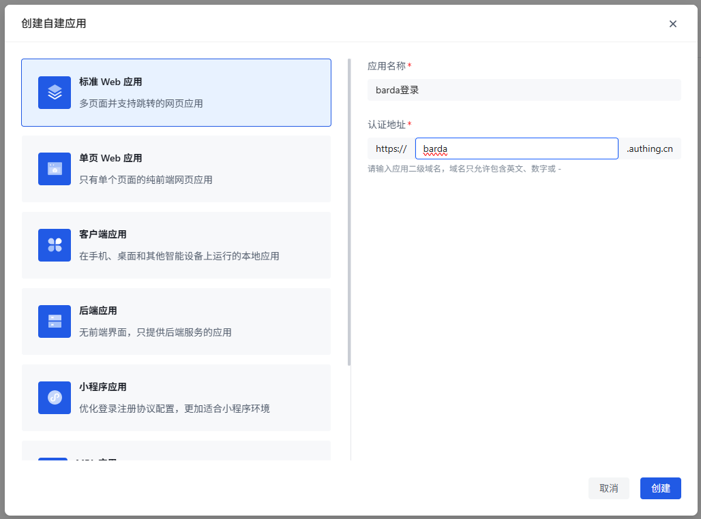
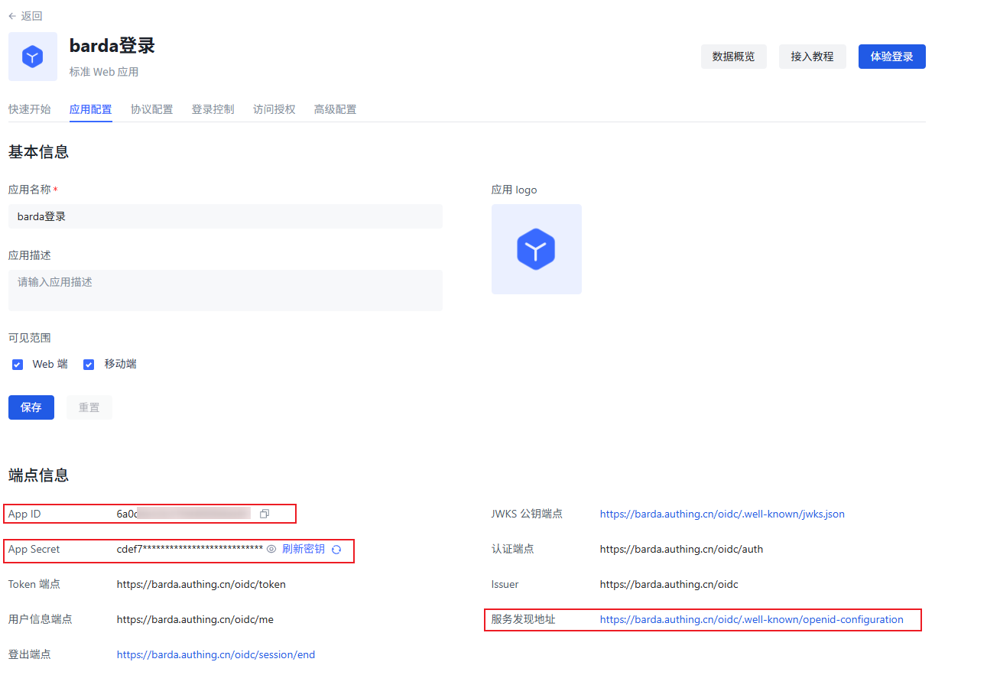
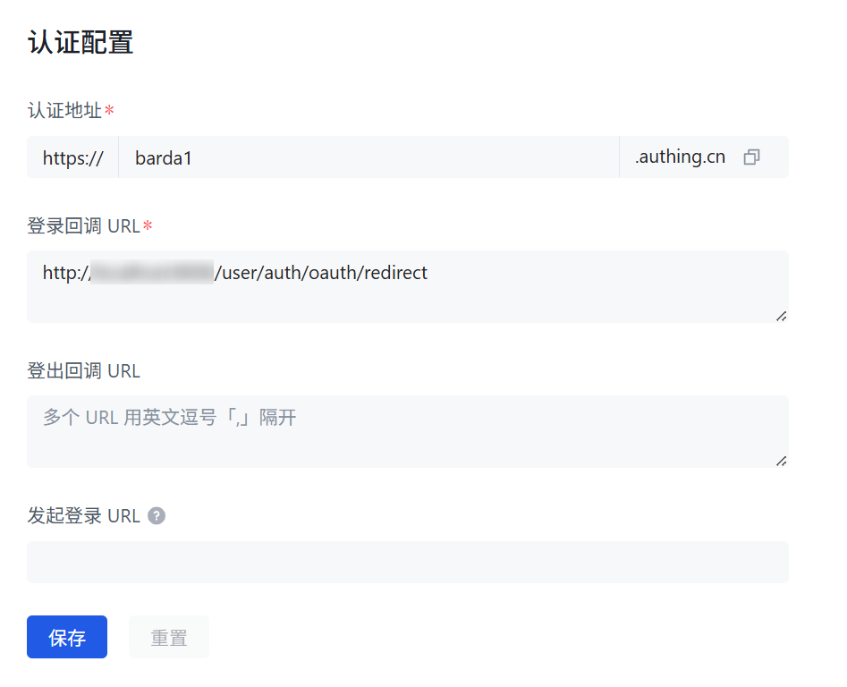
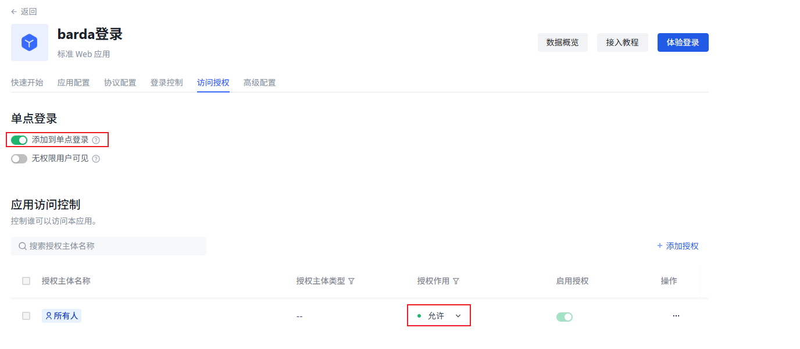
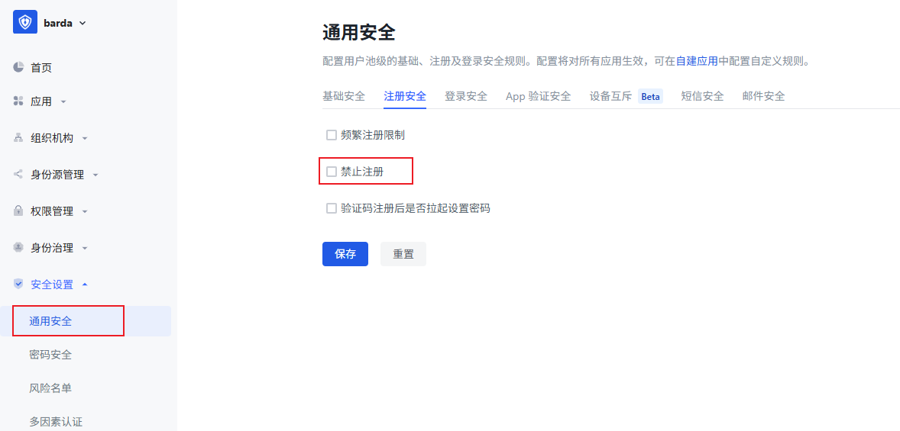

# 配置 Authing

[Authing](https://authing.cn) 完全支持 OIDC 标准协议，推荐使用自动发现功能简化配置。

## 步骤 1：在 Authing 中配置

1. 登录 [Authing 控制台](https://console.authing.cn)
2. 进入 **应用 → 自建应用 → 应用管理 → 创建自建应用**，选择应用类型，输入应用名称和认证地址后，点击创建

  

3. 记录以下信息：
   - **App ID** → 对应 Barda 的 Client ID
   - **App Secret** → 对应 Barda 的 Client Secret
   - **Well-Known Endpoint** → 对应 Barda 的 Well-Known 端点

  

3. 设置登录回调 URL

https://{你的Barda域名}/user/auth/oauth/redirect

  

4. 设置 **访问授权 → 单点登录** 的 **添加到单点登录** 为开启状态，**授权作用** 为**允许**

  

5. 设置 **通用安全 → 注册安全** 的 **禁止注册** 为关闭状态

  

## 步骤 2：在 Barda 中配置

### 下拉载入预设

在 Well-Known 端点输入框中，从下拉菜单选择 **Authing (OIDC 自动发现)**，系统自动填入 Issuer URI 模板。将 `{your-app}` 替换为实际应用域名，然后点击 **Fetch** 按钮自动拉取并填充所有端点。

### 填入凭证

填入第一步保存的 Client ID和App Secret

## 验证配置

1. 退出登录
2. 转到 Barda 登录页面，确认出现登录按钮
3. 点击按钮，确认能跳转到 Authing 登录页面
4. 完成登录后，确认能回到 Barda 并成功登录

## 常见问题

### 提示 `无权限登录此应用，请联系管理员`:

在 Authing 的自建应用设置页， **访问授权** 标签中，确保 **添加到单点登录** 为 **打开** 、 **授权作用** 为 **允许**
