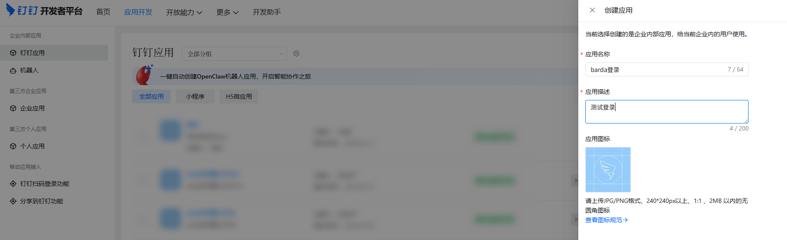
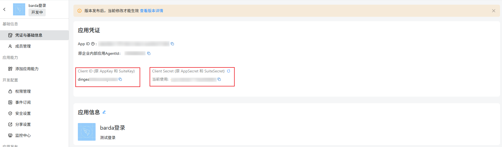
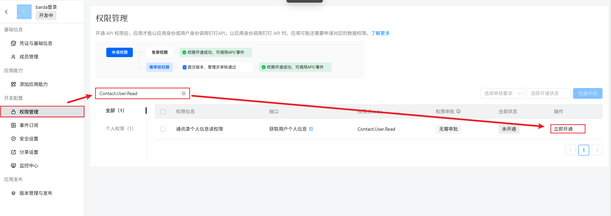
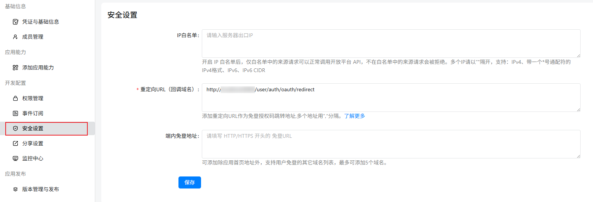
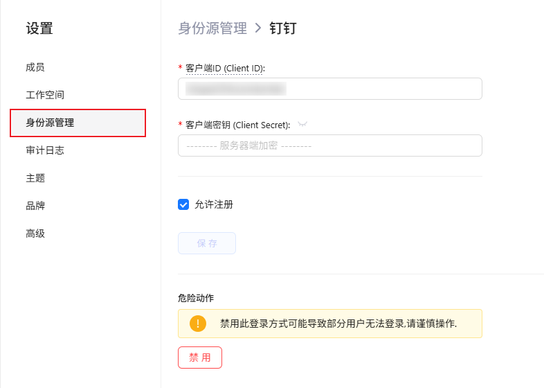
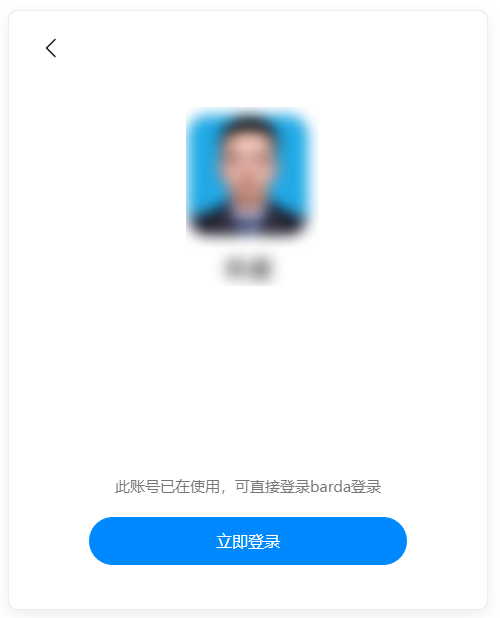

# 配置钉钉 (DingTalk)

[钉钉](https://www.dingtalk.com) 是阿里巴巴旗下的企业协作平台，提供 OAuth 2.0 授权登录能力。Barda 内置了钉钉 OAuth 支持，只需填入 Client ID 和 Client Secret 即可快速配置。

## 步骤 1：在钉钉开发者平台创建应用

1. 登录 [钉钉开发者平台](https://open-dev.dingtalk.com/fe/app)
2. 进入 **应用开发 → 创建应用**

4. 填写应用信息：
   - **应用名称**：自定义，如 "Barda 登录"
   - **应用描述**：自定义描述
   - **应用图标**：上传应用图标（将显示在钉钉授权页面）

  

5. 创建完成后，进入应用详情页，在 **凭证与基础信息** 中记录：
   - **Client ID**（原 AppKey / SuiteKey）→ 对应 Barda 的 Client ID
   - **Client Secret**（原 AppSecret / SuiteSecret）→ 对应 Barda 的 Client Secret

  

## 步骤 2：配置钉钉应用权限

进入 **权限管理** 页面，开启以下权限：

> **注意**：开通权限后需要**发布应用**才能生效。权限变更后必须重新发布应用。

  

## 步骤 3：配置回调地址

进入 **安全设置 → 回调域名**：

填入：https://{你的Barda域名}/user/auth/oauth/redirect

  

## 步骤 4：发布应用

1. 进入 **应用发布 → 版本管理与发布**
2. 点击 **创建新版本**，填写版本号和更新说明
3. 点击保存并确认发布

## 步骤 5：在 Barda 中配置

1. 进入 Barda **设置 → 身份源管理**
2. 点击列表中的 **钉钉 (DingTalk)**
3. 在配置表单中填写：

| 字段 | 填写值 | 说明 |
|------|--------|------|
| Client ID | 钉钉应用的 Client ID（原 AppKey） | 必填 |
| Client Secret | 钉钉应用的 Client Secret（原 AppSecret） | 必填 |

4. 点击 **保存**

  

## 验证配置

1. 退出当前账户
2. 确认出现 **钉钉** 登录按钮
3. 点击钉钉登录按钮，确认跳转到钉钉授权页面
4. 在钉钉页面确认授权后，确认能回到 Barda 并成功登录
5. 确认登录后的用户名和头像显示正确

  

## 常见问题

### 授权页面提示"redirect_uri 不在安全域名中"

检查钉钉开发者控制台 **安全设置 → 回调域名** 中配置的域名是否与 Barda 的 OAuth 重定向 URI 完全一致。钉钉要求：
- 域名完全匹配（包括子域名）
- 不需要包含路径部分，只需配置域名

### 获取用户信息返回空或报错

通常是因为未在钉钉控制台为该应用开通 `Contact.User.Read` 权限。开通权限后需要**重新发布**应用，并等待 1-2 分钟生效。

如需配置钉钉数据源，请参考 [连接钉钉](../api/dingTalk.md)。
