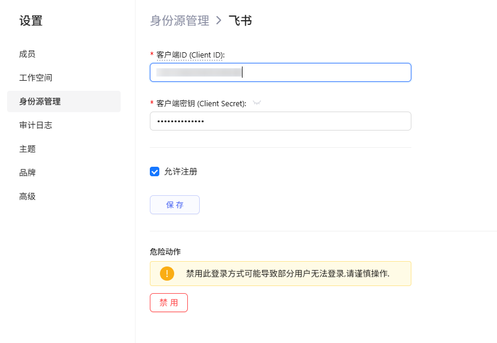
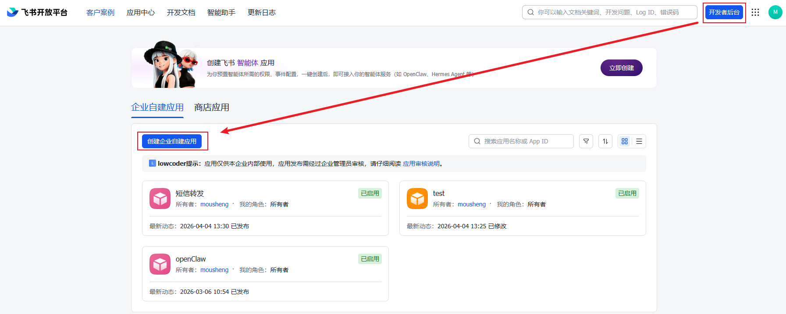
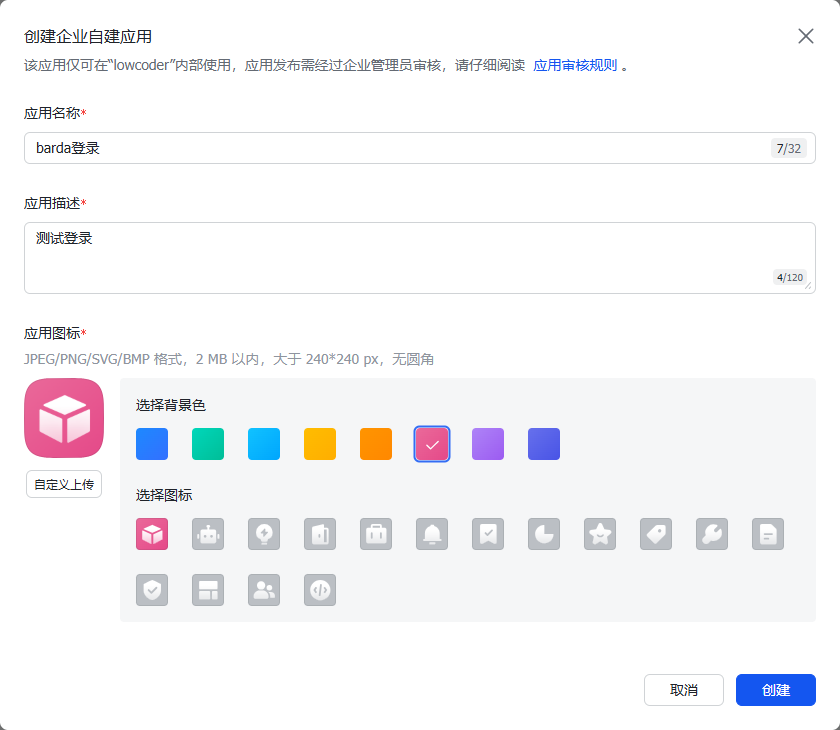
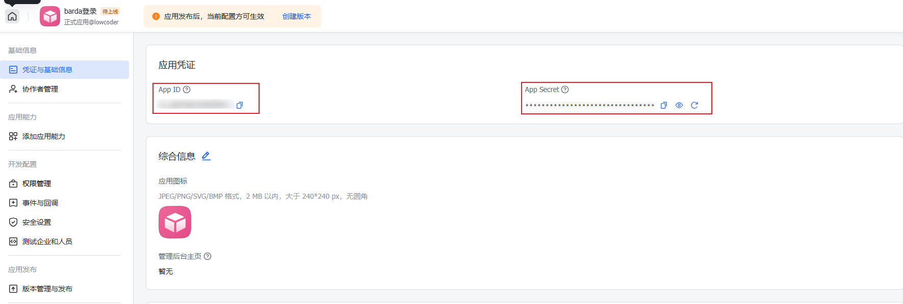
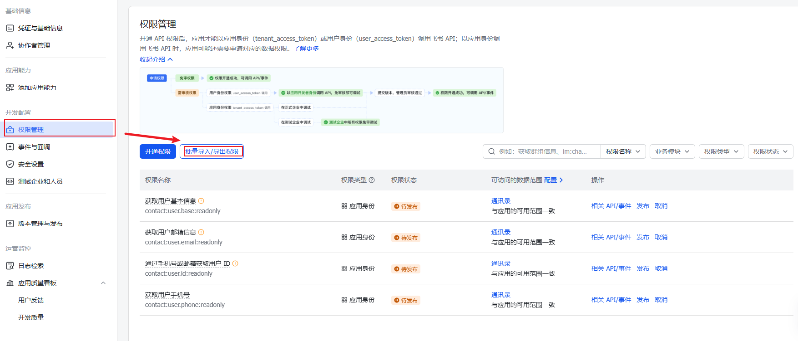
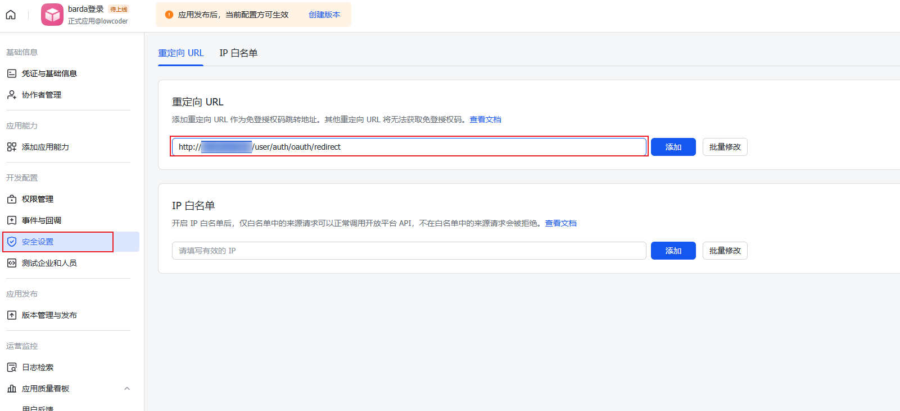
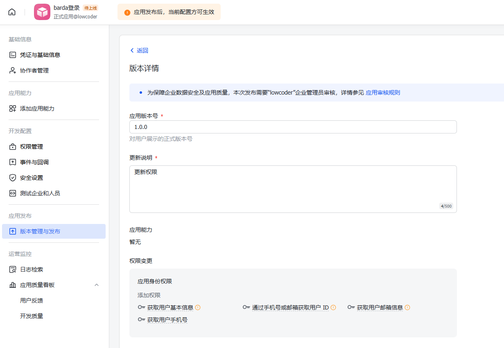
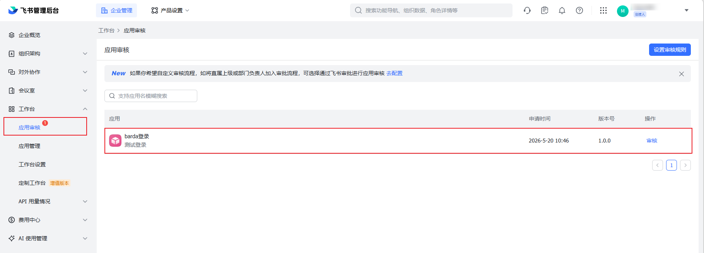
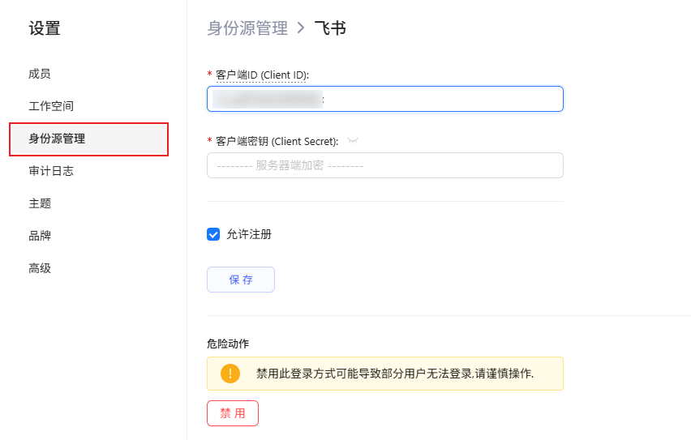
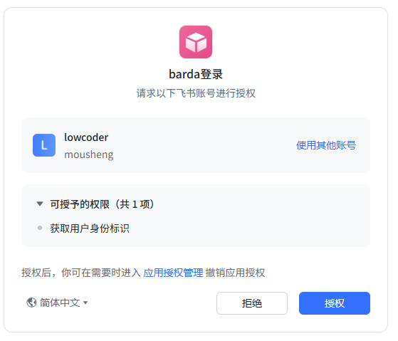

# 配置飞书 (Feishu)

[飞书](https://www.feishu.cn) 是企业协作平台，提供 OAuth 2.0 授权登录能力。Barda 内置了飞书 OAuth 支持，只需填入 Client ID 和 Client Secret 即可快速配置。

  


## 步骤 1：在飞书开发者平台创建应用

1. 登录 [飞书开发者平台](https://open.feishu.cn/app)

2. 进入 **开发者后台 → 创建企业自建应用**

  

3. 填写应用信息：
   - **应用名称**：自定义，如 "Barda 登录"
   - **应用描述**：自定义描述
   - **应用图标**：上传应用图标（将显示在飞书授权页面）

  

4. 创建完成后，进入应用详情页，记录以下信息：
   - **App ID** → 对应 Barda 的 Client ID
   - **App Secret** → 对应 Barda 的 Client Secret

  


## 步骤 2：配置飞书应用权限

在飞书开发者控制台中，进入应用详情页的 **权限管理** → **批量导入/导出权限** ，粘贴以下权限：

```json
{
    "scopes": {
        "tenant": [
            "contact:user.id:readonly",
            "contact:user.base:readonly",
            "contact:user.phone:readonly",
            "contact:user.email:readonly"
        ],
        "user": []
    }
}

```
> **注意**：开通权限后需要**发布应用**并等待管理员审批才能生效。权限变更后必须重新发布应用。

  

## 步骤 3：配置安全设置

进入应用详情页的 **安全设置** 页面：

1. 配置 **重定向 URL**：填入 https://{你的Barda域名}/user/auth/oauth/redirect


  


## 步骤 4：发布应用

1. 在飞书开发者控制台，进入 **版本管理与发布**
2. 点击 **创建版本**，填写版本号和更新说明
3. 点击底部的保存后，在弹出的对话框中，点击 **申请线上发布**。

  

4. 进入**飞书管理后台** → **应用审核** 审核通过后即可生效。

  


## 步骤 5：在 Barda 中配置

1. 进入 Barda **设置 → 身份源管理**
2. 点击列表中的 **飞书 (Feishu)**
3. 在配置表单中填写：

| 字段 | 填写值 | 说明 |
|------|--------|------|
| Client ID | 飞书应用的 App ID | 必填 |
| Client Secret | 飞书应用的 App Secret | 必填 |

4. 点击 **保存**

  


## 验证配置

1. 退出当前账户
2. 跳转到 Barda 登录页面，确认出现 **飞书** 登录按钮
3. 点击飞书登录按钮，确认跳转到飞书授权页面

  

4. 在飞书授权页面确认授权后，确认能回到 Barda 并成功登录

5. 确认登录后的用户名和头像显示正确

## 常见问题

### 授权时提示"应用未发布"

飞书应用必须先发布才能被非管理员用户使用。请到飞书开发者控制台 **应用发布 → 版本管理与发布** 中创建版本并发布。

### 获取用户信息失败（code: 9999xxx）

通常是因为未在飞书控制台为该应用开通 `contact:user.base:readonly` 权限。开通权限后需要**重新发布**应用。

### 重定向 URI 不匹配

检查 Barda 身份源页面底部显示的 OAuth 重定向 URI，确认与飞书控制台安全设置中配置的重定向 URL 完全一致（包括协议 `https://` 和路径大小写）。
