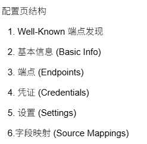
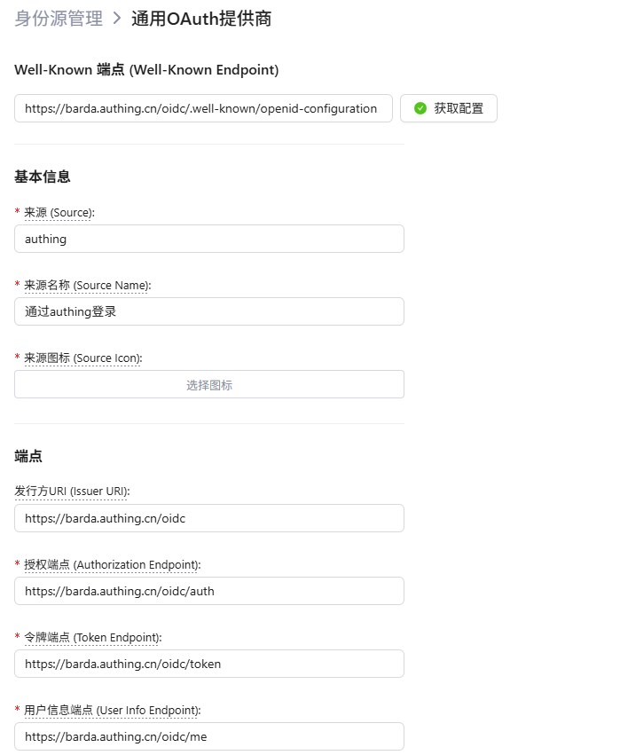

# 通用 OAuth 提供商 (Generic OAuth Provider)

通用 OAuth 提供商支持任意符合 OAuth 2.0 / OIDC 标准的第三方身份服务（如 Authing、Gitee 等）。

## 配置页结构

配置表单分为 6 个区域：

  

### 1. Well-Known 端点发现

Well-Known Endpoint 输入框支持**自由输入**和**下拉选择**两种方式：

- **自由输入**：直接输入完整的 Well-Known 端点 URL
- **下拉选择**：点击输入框下拉菜单，选择预设的提供商模板

**下拉预设提供商：**

| 预设 | 方式 | 行为 |
|------|------|------|
| **Authing (OIDC 自动发现)** | 自动发现 | 填入 Issuer URI 模板，将 `{your-app}` 替换为实际域名后点击「获取配置」自动拉取端点 |
| **Gitee (手动配置)** | 手动填充 | 直接自动填入所有端点字段（授权、令牌、用户信息端点、Scope、字段映射），无需 Fetch |

- **Issuer URI**：OIDC 发现端点 URL
  - 输入 Issuer URI 后自动推导 Well-Known 端点（格式：`{issuerUri}/.well-known/openid-configuration`）
  - 可手动编辑完整 URL
- **Fetch 按钮**：点击后自动从 Well-Known 端点拉取 OIDC 配置，填充下方端点字段
  - 拉取成功：绿色勾 + 提示"成功获取 OIDC 配置并自动填充端点"
  - 拉取失败：红色叉 + 具体错误信息
  - 加载中：旋转图标（Fetching...）
- 此区域为**可选**。OIDC 提供商（如 Authing）推荐使用；非 OIDC 提供商（如 Gitee）可从下拉菜单选择「Gitee」直接自动填充，无需手动填写端点

  

### 2. 基本信息 (Basic Info)

| 字段 | 必填 | 说明 |
|------|------|------|
| Source | **是** | 唯一标识符，用于系统区分不同提供商，建议使用英文字母和连字符 |
| Source Name | **是** | 显示在登录页面和身份源列表中的名称 |
| Source Icon | **是** | 显示在登录按钮中的图标，可选择预设图标 |

### 3. 端点 (Endpoints)

| 字段 | 必填 | 说明 |
|------|------|------|
| Issuer URI | 否 | OAuth 提供商的 Issuer 标识符，用于 OIDC 发现 |
| Authorization Endpoint | **是** | OAuth 授权端点 URL |
| Token Endpoint | **是** | OAuth 令牌端点 URL，用于换取 Access Token |
| User Info Endpoint | **是** | 获取用户信息的 API 端点 URL |

### 4. 凭证 (Credentials)

| 字段 | 必填 | 说明 |
|------|------|------|
| Client ID | **是** | OAuth 提供商分配的客户端 ID |
| Client Secret | **是** | OAuth 提供商分配的密钥，加密存储在服务器端 |

### 5. 设置 (Settings)

| 字段 | 必填 | 说明 |
|------|------|------|
| Scope | 否 | OAuth 权限范围，多个用空格分隔，如 `openid profile email` |
| User Can Select Accounts | 否 | 开启后用户登录时可以选择使用哪个账户（使用 `prompt=login`） |

### 6.字段映射 (Source Mappings)

将 OAuth 提供商返回的用户信息字段映射到 Barda 用户属性,具体参考提供商的文档：

| Barda 字段 | 说明 | 常见 OIDC 对应字段 |
|------------|------|-------------------|
| uid | 用户唯一标识符 | `sub` |
| email | 用户邮箱 | `email` |
| username | 用户名 | `name` / `preferred_username` |
| avatar | 用户头像 URL | `picture` |

## 配置示例

以下平台可通过 Well-Known 端点输入框的**下拉菜单**快速选择，自动填入预设配置：

- [配置 Authing](./identity-source/authing.md) — 支持 OIDC 自动发现，下拉选择后填入 Issuer 模板，替换域名后 Fetch 即可
- [配置 Gitee](./identity-source/gitee.md) — 不支持 OIDC 自动发现，下拉选择后自动填入所有端点字段，无需手动填写
