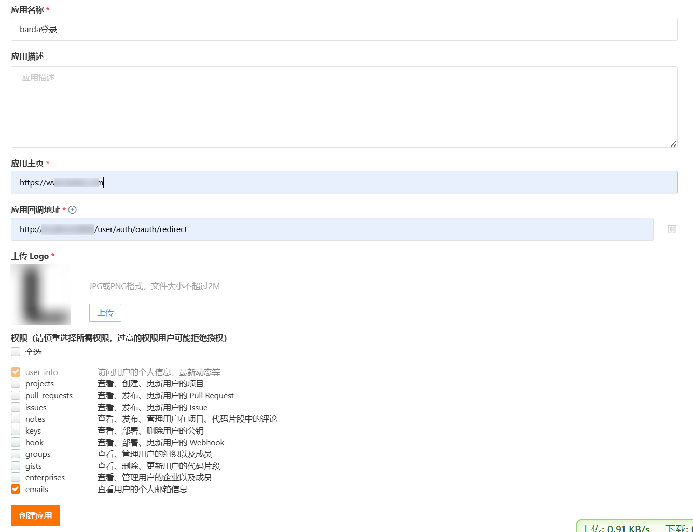

# 配置 Gitee

[Gitee](https://gitee.com) 是国内常用的代码托管平台，提供 OAuth 2.0 授权登录能力。Gitee **不支持 OIDC 自动发现**。

## 步骤 1：在 Gitee 中创建 OAuth 应用

1. 登录 [Gitee](https://gitee.com/profile/account_information)
2. 进入 **第三方应用 → 创建应用**
3. 填写应用信息：
   - **应用名称**：自定义，如 "Barda 登录"
   - **应用主页**: 随意填写网址
   - **应用回调地址**：https://{你的Barda域名}/user/auth/oauth/redirect
   - **权限**: 选择 **user_info** 、 **emails**

     

4. 创建完成后记录：
   - **Client ID**
   - **Client Secret**

## 步骤 2：在 Barda 中配置

### 下拉选择预设

在 Well-Known 端点输入框中，从下拉菜单选择 **Gitee (手动配置)**，系统自动填入所有端点字段和字段映射，无需手动填写。

### 填入步骤1保存的Client ID和Client Secret

## 验证配置

1. 在 Barda 中**启用**该身份源配置
2. 打开 Barda 登录页面，确认出现 "Gitee 登录" 按钮
3. 点击按钮跳转到 Gitee 授权页面
4. 授权后确认能回到 Barda 并成功登录
