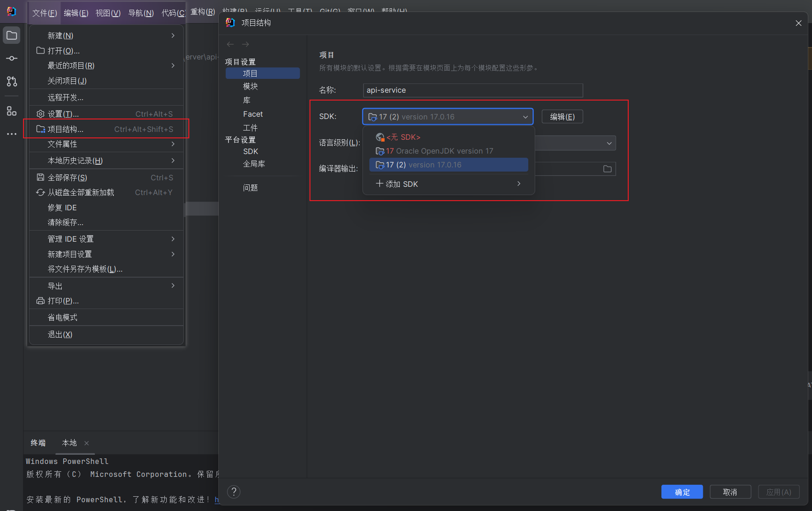
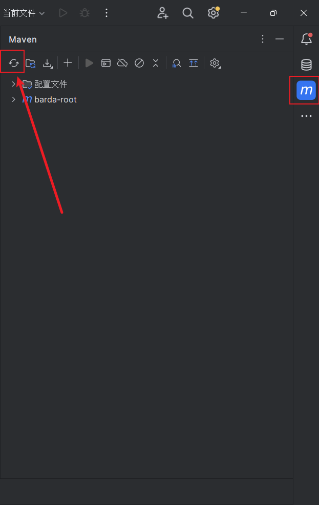

# 运行说明

本文档说明如何在本地启动 Barda 服务器。


## 系统先决条件

Java - OpenJDK 17  
Maven - 版本 3+（建议 3.8+）

## 新运行方式

如果您是通过Barda一键调试运行的，那么您只需要简单设置项目SDK版本并重新加载Maven项目即可快速调试

### 选择正确的SDK版本


### 重新加载Maven项目


## 手动方式

### MongoDB

如果您没有可用的 MongoDB，可以使用 docker 启动本地 MongoDB 服务：

```shell
docker run -d  --name barda-mongodb -p 27017:27017 -e MONGO_INITDB_DATABASE=barda mongo
```

### Redis

如果您没有可用的 Redis，可以使用 docker 启动本地 Redis 服务：

```shell
docker run -d --name barda-redis -p 6379:6379 redis
```

## 构建并启动 barda 服务器 jar

接下来，按顺序执行以下命令

```shell
cd server/api-service
mvn clean package -DskipTests
java "-Dpf4j.mode=development" "-Dspring.profiles.active=barda" "-Dpf4j.pluginsDir=barda-plugins" -jar barda-server/target/barda-server-1.0.1-SNAPSHOT.jar
```

现在，您可以通过浏览器访问 http://localhost:8080 来检查服务状态。默认情况下，您应该会看到 HTTP 404 错误。


## 使用 IntelliJ IDEA 启动

项目已经配置好IntelliJ IDEA的运行/调试配置，您可以直接点击运行按钮启动项目。

### 运行/调试配置

<table>
    <tr>
        <td style="width: 115px">JDK version</td>
        <td>Java 17  </td>
    </tr>
    <tr>
        <td>-cp </td>
        <td>barda-server </td>
    </tr>
    <tr>
        <td>VM options </td>
        <td>-Dpf4j.mode=development -Dpf4j.pluginsDir=barda-plugins -Dspring.profiles.active=barda -XX:+AllowRedefinitionToAddDeleteMethods --add-opens java.base/java.nio=ALL-UNNAMED</td>
    </tr>
    <tr>
        <td>Main class </td>
        <td>com.barda.api.ServerApplication </td>
    </tr>
</table>

接下来，按顺序执行以下命令

```shell
cd server/api-service
mvn clean package -DskipTests
```

Maven 打包成功运行后，您可以使用 IntelliJ IDEA 启动 barda 服务器。